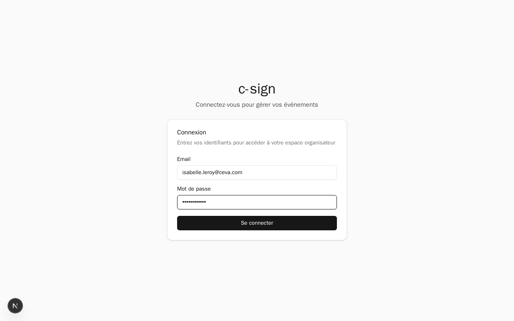
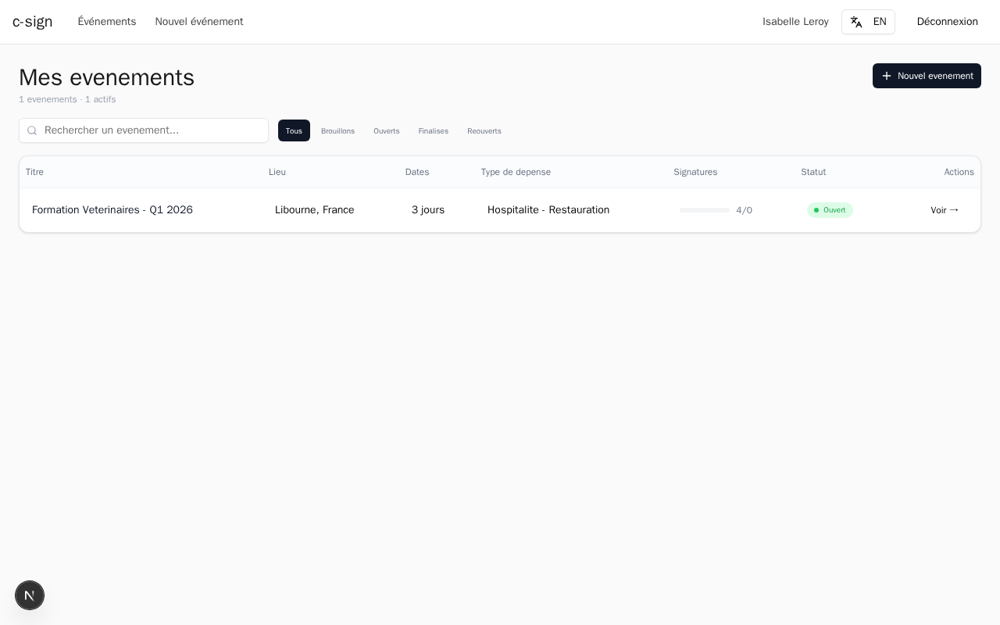

# Logging In to c-sign

This guide explains how to log in to c-sign as an organizer. You need valid credentials provided by your administrator.

## Step 1: Navigate to the login page

Open your browser and go to your c-sign URL. If you are not already logged in, you will be redirected to the login page automatically. You can also navigate directly by adding `/login` to the end of the URL.

The login page displays the c-sign title with the subtitle "Connectez-vous pour gerer vos evenements" and a **Connexion** card.

> **Tip:** The interface is in French by default. To switch to English, click the language toggle in the top-right corner of the page.

## Step 2: Enter your email address

Click the **Email** field and type the email address associated with your organizer account.

## Step 3: Enter your password

Click the **Mot de passe** field and type your password.

## Step 4: Click "Se connecter"

Click the **Se connecter** button to submit your credentials. The application will verify your email and password.

## Step 5: You are redirected to the dashboard

After a successful login, you are taken directly to the organizer dashboard. From here you can create and manage your events.

## Common issues

### Wrong password

If you see an error message after clicking **Se connecter**, double-check that your email and password are correct. Passwords are case-sensitive.

> **Tip:** Make sure Caps Lock is not enabled on your keyboard before retyping your password.

### Account locked after too many attempts

Your account is locked after 5 consecutive failed login attempts. This is a security measure to protect your account.

If your account is locked, wait a few minutes before trying again or contact your administrator to have it unlocked.

> **Warning:** Do not attempt to log in repeatedly with an incorrect password. After 5 failed attempts your account will be temporarily locked.

### Forgotten password

If you have forgotten your password, contact your administrator. They can reset it for you from the Payload CMS admin panel.

---

**Next:** [Getting Started](../getting-started.md)
