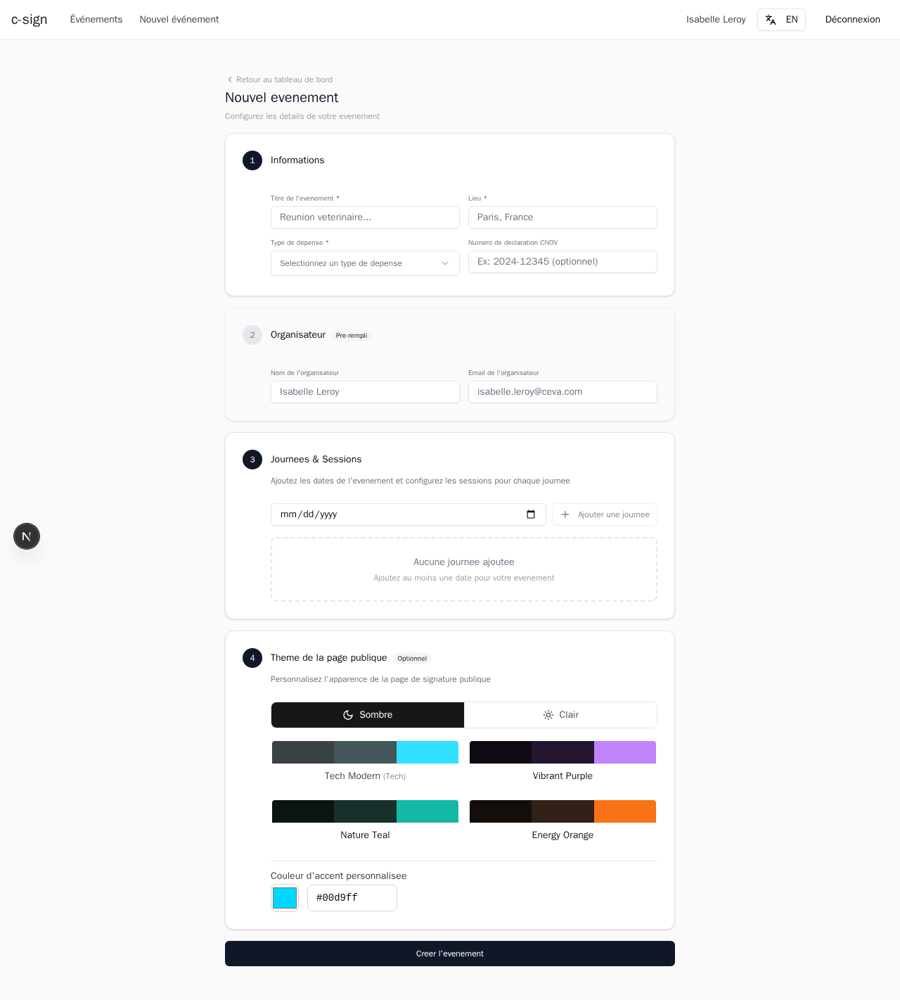

# Creating an Event

This guide walks you through the event creation form. When you finish, c-sign saves a new event in **Draft** status and takes you to its detail page.

## Getting to the Form

1. From the dashboard, click the **+ Nouvel evenement** button in the top-right corner.

The creation form opens with four numbered sections.

## Section 1 -- Informations

Fill in the basic details of your event.

1. Enter the **Titre de l'evenement** (event name). This is the title participants will see.
2. Enter the **Lieu** (location) -- for example, "Paris, France" or the name of the venue.
3. Open the **Type de depense** dropdown and select the expense category that applies to your event.

The available expense types are:

| Value | Description |
|-------|-------------|
| Hospitalite-snack | Snacks or light refreshments |
| Hospitalite-restauration | Meals and restaurant expenses |
| Hospitalite-hebergement | Lodging and accommodation |
| Frais d'inscription | Registration fees |
| Frais de reunion | Meeting expenses |
| Frais de transport | Travel and transport costs |

4. Optionally, enter a **Numero de declaration CNOV** if your event requires one (for example, `2024-12345`).

> **Tip:** The title and location are required fields. You cannot submit the form without them.

## Section 2 -- Organisateur

Your organizer name and email are pre-filled from your account. Review the values and correct them if needed.

1. Confirm the **Nom de l'organisateur** field.
2. Confirm the **Email de l'organisateur** field.

## Section 3 -- Journees and Sessions

Add one or more dates for your event. Multi-day and non-consecutive dates are both supported.

1. Click the date picker field (labeled **mm/dd/yyyy**) and select a date from the calendar.
2. Click **+ Ajouter une journee** to add that date.
3. Repeat for each additional day.

Each date you add appears as a row below the picker. You can remove a date by clicking the delete control next to it.

> **Note:** You must add at least one date before the event can be created. The message "Aucune journee ajoutee" will disappear once you add your first date.

## Section 4 -- Theme de la page publique (Optional)

Customize the look of the public signing page that participants see when they scan the QR code.

1. Choose a mode: **Sombre** (dark) or **Clair** (light).
2. Select one of the four preset color themes:
   - **Tech Modern** -- teal accent
   - **Vibrant Purple** -- purple accent
   - **Nature Teal** -- green-teal accent
   - **Energy Orange** -- orange accent
3. Alternatively, enter a custom hex color code in the **Couleur d'accent personnalisee** field (for example, `#00d9ff`).

If you skip this section, c-sign uses the default dark theme with a teal accent.

## Submitting the Form

1. Review all the fields.
2. Click the **Creer l'evenement** button at the bottom of the page.

If any required field is missing, the form highlights the error. Fix it and try again. Once the event is created, c-sign redirects you to the event detail page where you can add participants and open the event for signing.

> **Warning:** A new event starts in **Draft** status. Participants cannot sign until you open the event from its detail page. See [Manage Event](./manage-event.md) for instructions on changing the status.

## What Happens Next

After creation, your event appears in the dashboard table with a **Brouillon** (Draft) badge. From the event detail page you can:

- Add participants from the SIMV registry or manually.
- Open the event to start collecting signatures.
- Generate and share QR codes.
- Customize settings at any time.

---

Next: [Manage Event](./manage-event.md)
