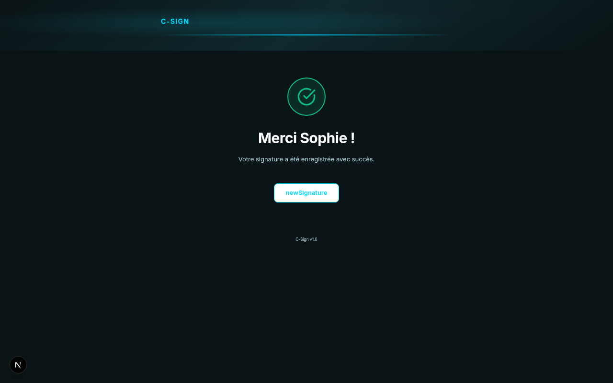

# How Participants Sign Attendance

This guide is for event participants. It explains how to sign an attendance sheet using your phone. You do not need to install an app or create an account.

## What you will need

- A smartphone with a camera (iPhone or Android)
- A web browser (Safari on iOS, Chrome on Android)
- Access to the QR code displayed at the event or shared by the organizer

## Overview

Your organizer displays a QR code at the event venue, on a screen or on a printed sheet. You scan it with your phone, fill in your details, draw your signature, and submit. The whole process takes under a minute.

## Step 1: Scan the QR code

Point your phone camera at the QR code. On most phones, a link notification appears automatically. Tap it to open the signing page in your browser.

> **Tip:** If your camera does not detect the QR code, open your phone's built-in QR scanner app. On iPhone, the default Camera app works. On Android, use the Google Lens icon in the Camera app or the search bar.

If the organizer sent you a direct link instead of a QR code, simply tap the link to open the signing page.

## Step 2: Select the attendance day (multi-day events)

If the event spans multiple days, you will see a list of dates. Select the day you are attending by tapping the corresponding radio button.

For single-day events, this step is skipped automatically.

## Step 3: Select the session (if applicable)

Some events have multiple sessions in a single day (for example, a morning session and an afternoon session). If sessions are listed, tap the one you are attending.

For events with only one session, this step is skipped automatically.

## Step 4: Fill in your personal information

Scroll down and fill in the following fields:

- **Nom** -- your last name
- **Prenom** -- your first name
- **Email** -- your email address
- **Ville** -- the city where you practice or reside
- **Numero professionnel** -- your professional registration number (optional)
- **Type de beneficiaire** -- select your role from the dropdown: Veterinaire, Pharmacien, Etudiant, ASV, Technicien, Eleveur, or Autre

> **Tip:** Fields marked with an asterisk are required. You cannot submit the form without completing them.

## Step 5: Draw your signature

A signature canvas appears below the form fields. Use your finger or a stylus to draw your signature directly on the screen.

> **Tip:** Turn your phone to landscape orientation for more space to sign. Use a steady hand and draw at a comfortable pace. If you make a mistake, tap the clear button to erase and start again.

## Step 6: Confirm the right-to-image consent

Check the consent checkbox at the bottom of the form. This confirms your agreement to the right-to-image terms for the event.

## Step 7: Submit

Tap the **Signer** button to submit your attendance. Your signature is uploaded immediately to the server. Nothing is stored on your phone.

## Step 8: View the confirmation

After a successful submission, you will see a confirmation screen with a checkmark and a personalized thank-you message.

You can now close the browser tab. Your attendance has been recorded.

> **Tip:** If another participant needs to sign on the same phone, tap the **Nouvelle signature** button to return to the signing form with a blank slate.

## Switching to English

The signing page is in French by default. To switch to English, tap the language toggle in the top-right corner of the page. All labels and instructions will update immediately.

## Troubleshooting

### The QR code does not open anything

Make sure you are scanning with your phone's camera or a QR reader app. If the link opens but shows an error, the event may not be open for signatures yet. Ask the organizer to confirm that the event is active.

### The page says the event is finalized or the link is invalid

The organizer has closed the event for new signatures. Contact them to request that the event be reopened if you still need to sign.

### My signature did not go through

Check your internet connection. The signing page requires an active mobile data or Wi-Fi connection to submit. If submission fails, your form data is still on screen. Reconnect and tap **Signer** again.

### The form is hard to read on my phone

Pinch to zoom if text appears too small. The interface uses a dark theme for readability in varied lighting conditions.

---

**Next:** [FAQ / Common Issues](../faq.md)
